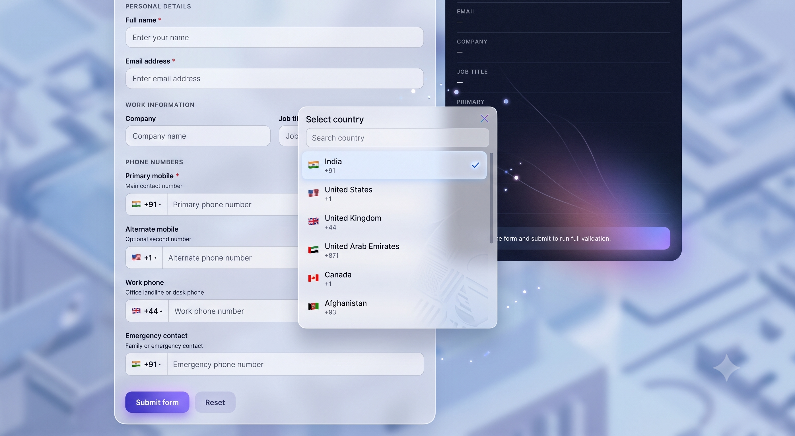
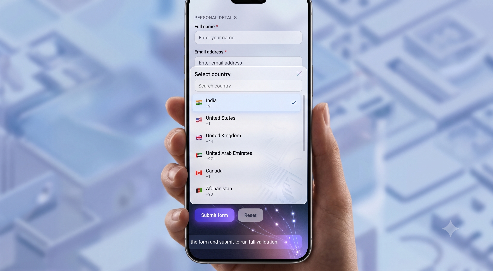

# multi-nation-input

International phone input with country picker, dial codes, and validation.

Works on **React Native** (iOS/Android) and **web** using the same package via `react-native-web`.

## Links

- **Live demo:** https://multi-nation-input.netlify.app/
- **GitHub:** https://github.com/vikashwebb/multi-nation-input
- **npm:** https://www.npmjs.com/package/multi-nation-input

## Live Demo

**[Open interactive demo](https://multi-nation-input.netlify.app/)** — registration form with 4 phone inputs.

## Screenshots

**Desktop**



**Mobile**



## Features

- Country picker with search
- 100+ countries with dial codes and flags
- Phone number validation per country
- Formatted display (US/CA and India helpers included)
- Controlled and uncontrolled usage
- Custom country lists (`onlyCountries`, `excludeCountries`, `preferredCountries`)
- Same API on mobile and web

## Installation

```bash
npm install multi-nation-input
```

### React Native

No extra setup required.

### Web (React + react-native-web)

```bash
npm install react-native-web react-dom
```

Configure your bundler to alias `react-native` to `react-native-web`.

## Usage

```jsx
import React, { useState } from 'react';
import { View, Text } from 'react-native';
import { MultiNationInput } from 'multi-nation-input';

export default function App() {
  const [phone, setPhone] = useState('');
  const [fullNumber, setFullNumber] = useState(null);

  return (
    <View style={{ padding: 20 }}>
      <MultiNationInput
        value={phone}
        defaultCountry="IN"
        preferredCountries={['IN', 'US', 'GB', 'AE']}
        onChangeText={setPhone}
        onChangeFullNumber={setFullNumber}
        placeholder="Enter mobile number"
      />

      {fullNumber?.isValid ? (
        <Text>Full number: {fullNumber.fullNumber}</Text>
      ) : null}
    </View>
  );
}
```

## Props

| Prop | Type | Default | Description |
|------|------|---------|-------------|
| `value` | `string` | — | Controlled national number (digits only) |
| `defaultValue` | `string` | `''` | Initial number for uncontrolled mode |
| `defaultCountry` | `string` | `'US'` | ISO country code |
| `onChangeText` | `(phone: string) => void` | — | Returns sanitized digits |
| `onChangeFormattedText` | `(formatted: string) => void` | — | Returns formatted display value |
| `onChangeFullNumber` | `(payload) => void` | — | Returns phone, country, validity, and `+` prefixed number |
| `onChangeCountry` | `(country) => void` | — | Called when country changes |
| `onValidationChange` | `(isValid: boolean) => void` | — | Validation state updates |
| `placeholder` | `string` | `'Phone number'` | Input placeholder |
| `disabled` | `boolean` | `false` | Disable input and picker |
| `onlyCountries` | `string[]` | — | Restrict available countries |
| `excludeCountries` | `string[]` | — | Remove countries from list |
| `preferredCountries` | `string[]` | — | Show selected countries first |
| `error` | `string` | — | Custom error message |
| `showError` | `boolean` | `true` | Show validation/custom error |

## Utilities

```js
import {
  COUNTRIES,
  validatePhoneNumber,
  formatInternationalNumber,
  getCountryByCode,
} from 'multi-nation-input';

validatePhoneNumber('9876543210', 'IN'); // true
formatInternationalNumber('9876543210', 'IN'); // +919876543210
getCountryByCode('US'); // { code: 'US', name: 'United States', ... }
```

## Web note

This package uses React Native primitives (`View`, `TextInput`, `Modal`, etc.). On web, install and configure `react-native-web` in your app so those components render in the browser.

## Testing

```bash
npm test
```

## License

MIT
